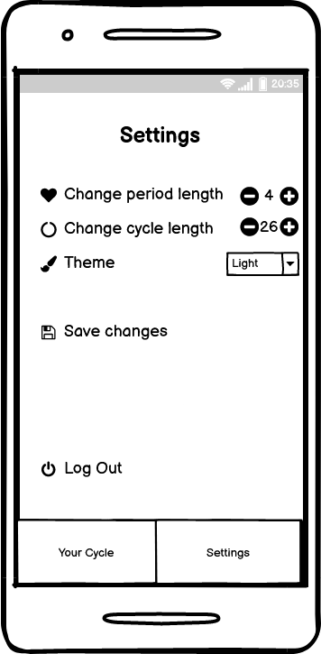

# Periodt

An app where users can track their period schedule. The app can **predict the user's future period schedule, ovulation day, and fertile window**. The cycle used for prediction of future period schedule is calculated by counting the days between the last day of the last period and the first day of the current period. The fertile window is predicted by substracting 14 days from current period cycle and lasts for 5 days. The ovulation is calculated one day after the fertile window.

The target segment for this app is people with uteruses that might want to **track their period and predict their fertile window**.

This app features:

* A start screen that will to redirect the user either to the login page or the registration page. The user can then log in or sign up their email.

* A calendar where the user can insert their period days and the app will predict when their next period, ovulation and fertile window will be.

* A statistic that shows the average length of the user's period and period cycle.

  
* A settings screen where the user can manually change the average length of their period and period cycle, color scheme, and log out of the app.

_by Nadira Meidina Yasmine_
